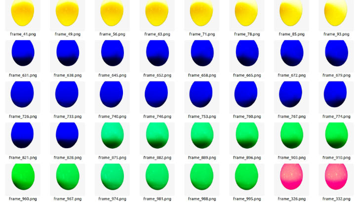

# Insidegg Project - Automated Estimation of Chicken Egg Components Mass

This project aims to develop an automated method to estimate the mass of chicken egg components (yolk, albumen, and shell) without breaking the eggs, using advanced Computer Vision and Artificial Intelligence techniques.

<p align="center">
  <!-- insert video final_result.mp4 with autoplay -->
  <video src="final_result.mp4" autoplay muted loop width="45%"></video>
  
</p>

## About the Project

The complete dissertation is currently awaiting publication by the University of São Paulo (USP). The link will be updated here once it's officially available.

The dataset containing all captured videos and measured masses is available on Kaggle:

- 📊 [Insidegg Dataset (Kaggle)](https://www.kaggle.com/datasets/aldrumont/insidegg-v2)

The final trained models are provided in the `final_models` directory.  
The prototype source code for image capturing is available in the `raspi` directory.

## Repository Structure

```
insidegg/
├── final_models/        # Contains final trained CNN models
├── raspi/               # Raspberry Pi prototype code for image capturing
├── scripts/             # Data processing and training scripts
│   ├── get_videos.py
│   ├── detect_colors.py
│   ├── extract_frames.py
│   └── neural_network.py
├── docker-compose.yml   # Docker-compose configuration
├── .env                 # File to configure Kaggle API credentials
└── README.md            # This documentation file
```

## Experiment Reproduction Instructions

To reproduce the entire experiment locally, follow these steps:

### Prerequisites

- Docker installed ([Guide](https://docs.docker.com/get-docker/))
- NVIDIA Docker Toolkit for GPU support ([Guide](https://docs.nvidia.com/datacenter/cloud-native/container-toolkit/install-guide.html))
- Kaggle API credentials ([Instructions](https://www.kaggle.com/docs/api))

### Steps

1. **Clone the repository:**

```bash
git clone https://github.com/aldrumont/insidegg.git
cd insidegg
```

2. **Set up Kaggle credentials:**  
Edit the `.env` file with your Kaggle API credentials (`KAGGLE_USERNAME`, `KAGGLE_KEY`).

3. **Build and launch the Docker container:**

```bash
docker compose up -d --build
```

### Running Scripts (inside container)

Use the following scripts inside the container to reproduce the experiment:

- **Download dataset from Kaggle:**

```bash
python get_videos.py
```

> *The following steps are optional if using the provided `color_start_times.xlsx`. Execute them only if you intend to fully reproduce the project (this can take several minutes or hours depending on hardware).*

- **Detect color transitions:**

```bash
python detect_colors.py
```

- **Extract frames from videos:**

```bash
python extract_frames.py
```

*(Parameters such as the number of frames per color can be modified in this script.)*

- **Train neural network:**

```bash
python neural_network.py
```

### Useful Docker Commands (Optional):

- **Access the container shell:**

```bash
docker compose exec [service-name] bash
```

- **View logs:**

```bash
docker compose logs -f
```

- **Stop and remove containers:**

```bash
docker compose down
```

## TODO

- [ ] Update link to official dissertation upon publication.
- [ ] Add link to published article when available.
- [ ] Include script dedicated exclusively to validation.
- [ ] Add a parameter configuration file to simplify adjustments.

## Support and Contact

If you encounter any issues or need further clarification, please feel free to reach out:

- 📧 **Email:** ferrazjunior97@gmail.com
- 🔗 **LinkedIn:** [Aldrumont Ferraz Júnior](https://www.linkedin.com/in/aldrumont-ferraz-j%C3%BAnior-01a80a78/)
